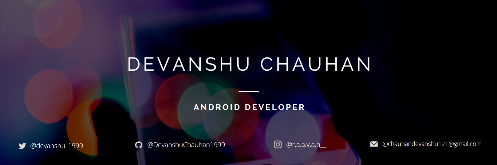

# Hi, I am Devanshu Chauhan! Great to see you here! 

I am Devanshu Chauhan, currently in the final year of my MCA from ITM University, Gwalior. I am a tech savant and always open to collaborating on projects and innovative ideas. Currently, I am an learning Android's new stuff like Jetpack Compose and KTOR.
 

  
 

## 🔗 Find out more about me & feel free to connect with me here:

 

## ⚡ Technologies:
### Language :

## 💎 Libraries & Framework :

## 📈 Stats

 

